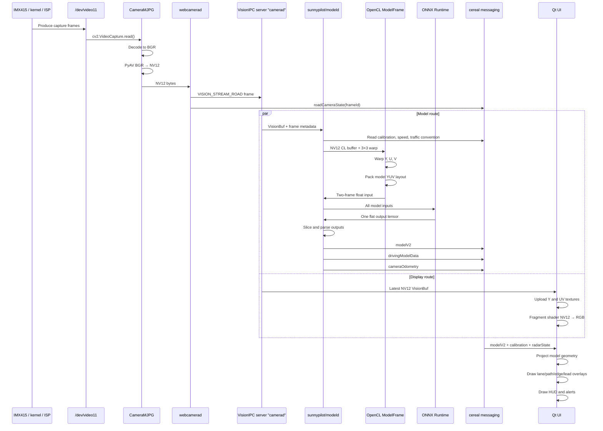

# THE OMNISCIENT  
# IMX415 → ONNX → `modelV2` → Qt UI Pipeline

> **Repository:** `Deggory/sunnypilot-pc`  
> **Scope:** The repository's own camera, VisionIPC, model preprocessing, ONNX Runtime, model-output parsing, cereal messaging, and Qt rendering pipeline.  
> **Analysis basis:** Repository snapshot packed in `repomix.md`, with key files spot-checked against the repository default branch on 2026-06-22.  
> **Important:** This document describes the code as it exists. It does not assume any earlier design, optimization plan, RKNN integration, RGA pipeline, or external project reference.

---

## 1. Executive summary

The repository contains the building blocks for this logical pipeline:

```text
/dev/video11
    │
    ▼
tools/webcam/camera.py
CameraMJPG
    │
    ├── requests MJPG, 1280×720, 20 FPS
    ├── OpenCV decodes the captured frame to BGR
    └── PyAV converts BGR to NV12
    │
    ▼
tools/webcam/camerad.py
    │
    ├── VisionIPC: VISION_STREAM_ROAD
    └── cereal: roadCameraState
    │
    ├──────────────────────────────────────────────┐
    │                                              │
    ▼                                              ▼
sunnypilot/modeld/modeld.py               Qt CameraWidget
    │                                     receives the NV12 stream
    ▼                                              │
OpenCL warp and YUV packing                        ▼
512×256 model input                        OpenGL NV12 → RGB display
two-frame temporal buffer
    │
    ▼
sunnypilot/modeld/models/supercombo.onnx
ONNX Runtime
    │
    ▼
output slicing using generated model metadata
    │
    ▼
parse_model_outputs.py
    │
    ▼
fill_model_msg.py
    │
    ├── modelV2
    ├── drivingModelData
    └── cameraOdometry
    │
    ▼
Qt ModelRenderer
    │
    ├── lane lines
    ├── road edges
    ├── predicted path
    └── radar-fused lead markers
    │
    ▼
AnnotatedCameraWidget
    │
    ▼
Road image + AI overlays + HUD
```

However, there is an important difference between **code availability** and **default process-manager behavior**:

1. `tools/webcam/camerad.py` is selected when `USE_WEBCAM` is set.
2. `sunnypilot/modeld/modeld.py` can select `supercombo.onnx` on a PC.
3. The process manager disables the `modeld_snpe` process on PC with `enabled=not PC`.
4. The normal PC manager instead starts `selfdrive.modeld.modeld` when the selected runner is `stock`.

Therefore:

> The complete IMX415 → `sunnypilot/modeld/supercombo.onnx` → UI path exists in the repository, but the current PC manager does not automatically wire that exact model process into the normal PC startup path.

This document explains both the intended data path and the current startup gap.

---

## 2. The two independent data routes

The final on-road screen is composed from two separate routes.

### 2.1 Camera-image route

```text
IMX415
  → Linux V4L2 device
  → OpenCV/PyAV
  → NV12
  → VisionIPC
  → CameraWidget
  → OpenGL texture upload
  → road image on screen
```

### 2.2 AI-result route

```text
The same NV12 VisionIPC frame
  → ModelFrame OpenCL preprocessing
  → supercombo.onnx
  → raw flat output tensor
  → output slicing
  → probability/distribution parsing
  → modelV2
  → ModelRenderer
  → lane/path/edge polygons
```

The camera image does not pass “through” `modelV2`. The UI receives the raw image directly from VisionIPC and receives AI geometry separately through cereal messaging.

---

## 3. Repository files involved

### Camera acquisition

```text
tools/webcam/camera.py
tools/webcam/camerad.py
```

### Camera stream and messaging

```text
msgq.visionipc
cereal/messaging
cereal/log.capnp
cereal/services.py
```

### Model process

```text
sunnypilot/modeld/modeld.py
sunnypilot/modeld/constants.py
sunnypilot/modeld/get_model_metadata.py
sunnypilot/modeld/models/supercombo.onnx
sunnypilot/modeld/models/commonmodel.cc
sunnypilot/modeld/models/commonmodel.h
sunnypilot/modeld/models/commonmodel_pyx.pyx
sunnypilot/modeld/runners/__init__.py
sunnypilot/modeld/runners/run_helpers.py
sunnypilot/modeld/runners/onnxmodel.py
sunnypilot/modeld/runners/runmodel.h
sunnypilot/modeld/runners/runmodel_pyx.pyx
sunnypilot/modeld/transforms/transform.cc
sunnypilot/modeld/transforms/transform.cl
sunnypilot/modeld/transforms/loadyuv.cc
sunnypilot/modeld/transforms/loadyuv.cl
sunnypilot/modeld/parse_model_outputs.py
sunnypilot/modeld/fill_model_msg.py
sunnypilot/modeld/SConscript
```

### Camera calibration and projection

```text
common/transformations/camera.py
common/transformations/model.py
selfdrive/locationd/calibrationd.py
```

### Qt camera display and overlays

```text
selfdrive/ui/ui.cc
selfdrive/ui/ui.h
selfdrive/ui/qt/widgets/cameraview.cc
selfdrive/ui/qt/widgets/cameraview.h
selfdrive/ui/qt/onroad/onroad_home.cc
selfdrive/ui/qt/onroad/onroad_home.h
selfdrive/ui/qt/onroad/annotated_camera.cc
selfdrive/ui/qt/onroad/annotated_camera.h
selfdrive/ui/qt/onroad/model.cc
selfdrive/ui/qt/onroad/model.h
selfdrive/ui/qt/onroad/hud.cc
selfdrive/ui/qt/onroad/driver_monitoring.cc
selfdrive/ui/SConscript
```

### sunnypilot UI wrappers

```text
selfdrive/ui/sunnypilot/ui.cc
selfdrive/ui/sunnypilot/ui.h
selfdrive/ui/sunnypilot/qt/onroad/onroad_home.cc
selfdrive/ui/sunnypilot/qt/onroad/onroad_home.h
selfdrive/ui/sunnypilot/qt/onroad/annotated_camera.cc
selfdrive/ui/sunnypilot/qt/onroad/annotated_camera.h
selfdrive/ui/sunnypilot/qt/onroad/model.cc
selfdrive/ui/sunnypilot/qt/onroad/model.h
selfdrive/ui/sunnypilot/SConscript
```

### Process selection

```text
system/manager/process_config.py
system/manager/manager.py
launch_openpilot.sh
launch_env.sh
```

---

# PART I — STARTUP AND PROCESS SELECTION

## 4. How the webcam camera process is selected

In `system/manager/process_config.py`:

```python
WEBCAM = os.getenv("USE_WEBCAM") is not None
```

The process list contains:

```python
NativeProcess(
  "camerad",
  "system/camerad",
  ["./camerad"],
  driverview,
  enabled=not WEBCAM,
)

PythonProcess(
  "webcamerad",
  "tools.webcam.camerad",
  driverview,
  enabled=WEBCAM,
)
```

Meaning:

| Environment | Camera process |
|---|---|
| `USE_WEBCAM` unset | Native Qualcomm-oriented `system/camerad` |
| `USE_WEBCAM=1` | Python `tools.webcam.camerad` |

For `/dev/video11`, the environment value must currently be:

```bash
ROAD_CAM=11
```

The code constructs the path itself:

```python
cam_device = f"/dev/video{c.cam_id}"
```

Therefore:

```bash
ROAD_CAM=11
```

becomes:

```text
/dev/video11
```

Do **not** pass the complete path to the current `camerad.py`:

```bash
ROAD_CAM=/dev/video11
```

because it would construct an invalid string resembling:

```text
/dev/video/dev/video11
```

### Road camera only

By default, the webcam process also adds a driver camera at `/dev/video2`.

For a single road camera, use:

```bash
NO_DM=1
```

Otherwise startup may fail when `/dev/video2` is unavailable.

A representative environment is:

```bash
USE_WEBCAM=1
ROAD_CAM=11
NO_DM=1
```

---

## 5. How the model process is selected

The manager defines three model-process families.

### Stock model process

```python
PythonProcess(
  "modeld",
  "selfdrive.modeld.modeld",
  and_(only_onroad, is_stock_model),
)
```

### Legacy sunnypilot model process

```python
NativeProcess(
  "modeld_snpe",
  "sunnypilot/modeld",
  ["./modeld"],
  and_(only_onroad, is_snpe_model),
  enabled=not PC,
)
```

### Newer sunnypilot model process

```python
NativeProcess(
  "modeld_tinygrad",
  "sunnypilot/modeld_v2",
  ["./modeld"],
  and_(only_onroad, is_tinygrad_model),
  enabled=not PC,
)
```

The runner selection defaults to `stock` when no active custom bundle exists.

The critical detail is:

```python
enabled=not PC
```

on both sunnypilot model processes.

As a result, on a PC:

- `webcamerad` can run.
- The UI can run.
- The stock `selfdrive.modeld.modeld` can run.
- The legacy `sunnypilot/modeld/modeld.py` ONNX process is not automatically started by the manager.

### What this means

The following ONNX code path is real:

```text
sunnypilot/modeld/modeld.py
  → get_model_path()
  → supercombo.onnx
  → ONNXModel
```

But it must be deliberately wired into the PC process configuration or run in a controlled bench setup with the stock model process disabled.

Two model processes must never publish `modelV2` simultaneously.

---

# PART II — IMX415 AND LINUX CAMERA CAPTURE

## 6. What “IMX415” means to this repository

The webcam code does not communicate directly with the IMX415 sensor over I²C and does not configure RKISP, MIPI CSI-2, exposure registers, gain registers, media-controller links, or ISP tuning.

The repository sees only a Linux video node:

```text
/dev/video11
```

Everything below that node is outside `tools/webcam`:

```text
IMX415 sensor
  → MIPI CSI-2 receiver
  → kernel sensor driver
  → ISP/media pipeline
  → V4L2 capture node
  → /dev/video11
```

The webcam code assumes `/dev/video11` already produces a format OpenCV can capture.

Therefore, the first real interface boundary is:

```text
Linux V4L2 userspace API
```

not the raw IMX415 sensor.

---

## 7. `Camera` versus `CameraMJPG`

`tools/webcam/camera.py` contains two classes.

### 7.1 `Camera`

`Camera` uses PyAV directly:

```python
self.container = av.open(camera_id)
```

It decodes frames, converts them to RGB, reverses the channel order to BGR, and then converts BGR to NV12.

```python
img = frame.to_rgb().to_ndarray()[:, :, ::-1]
yuv = Camera.bgr2nv12(img)
yield yuv.data.tobytes()
```

### 7.2 `CameraMJPG`

`CameraMJPG` uses OpenCV:

```python
self.cap = cv2.VideoCapture(camera_id)
```

It requests MJPG, 1280×720 and 20 FPS.

`tools/webcam/camerad.py` instantiates:

```python
cam = CameraMJPG(...)
```

Therefore the active webcam path uses `CameraMJPG`, not `Camera`.

---

## 8. Camera format configuration

`CameraMJPG._configure_camera_format()` performs:

```python
fourcc = cv2.VideoWriter_fourcc(*"MJPG")
self.cap.set(cv2.CAP_PROP_FOURCC, fourcc)
self.cap.set(cv2.CAP_PROP_FRAME_WIDTH, 1280)
self.cap.set(cv2.CAP_PROP_FRAME_HEIGHT, 720)
self.cap.set(cv2.CAP_PROP_FPS, 20)
```

The FourCC assignment is duplicated in the current code.

These are requests, not guarantees. A V4L2 driver may return another format, resolution, or frame rate.

The code reads back:

```python
self.fps
self.W
self.H
self.current_format
```

and prints the actual reported FPS and FourCC.

### Important behavior

The comments suggest an MJPG fallback, but both branches currently perform the same final operation:

```python
yield self._bgr_to_nv12(frame)
```

The only special MJPG behavior is a shape check:

```python
if frame.shape != (self.H, self.W, 3):
    raise ValueError(...)
```

---

## 9. What OpenCV returns

Even when the camera transports MJPEG, this call:

```python
ret, frame = self.cap.read()
```

normally returns a decoded OpenCV image:

```text
height × width × 3
BGR888
```

At 1280×720:

```text
1280 × 720 × 3 = 2,764,800 bytes
```

This is approximately 2.64 MiB for one BGR frame.

MJPEG reduces bandwidth between the camera driver and the capture API, but the code still expands the image to BGR in memory.

---

## 10. BGR to NV12 conversion

The conversion is:

```python
frame = av.VideoFrame.from_ndarray(bgr_frame, format="bgr24")
return frame.reformat(format="nv12").to_ndarray().data.tobytes()
```

Conceptually:

```text
BGR888
  → PyAV VideoFrame
  → color conversion and chroma subsampling
  → NV12 ndarray
  → Python bytes object
```

### NV12 layout

NV12 is a YUV 4:2:0 format.

```text
Plane 0: full-resolution Y
Plane 1: interleaved U/V at half width and half height
```

At 1280×720:

```text
Y plane:
1280 × 720 = 921,600 bytes

UV plane:
1280 × 360 = 460,800 bytes

Total:
1,382,400 bytes per frame
```

At 20 FPS, the raw NV12 payload alone is approximately:

```text
27,648,000 bytes per second
≈ 26.4 MiB/s
```

This excludes the BGR frame, temporary PyAV objects, OpenCL buffers, VisionIPC storage, UI textures, and ONNX arrays.

---

## 11. Copies and allocations in camera capture

The current active camera path contains several memory operations:

```text
V4L2/OpenCV capture buffer
  ↓ decode/copy
OpenCV BGR ndarray
  ↓ wrap/convert
PyAV frame
  ↓ color conversion
NV12 ndarray
  ↓ bytes materialization
Python bytes object
  ↓ VisionIPC send
VisionIPC-owned frame buffer
```

At minimum, the pipeline creates:

- a BGR image,
- an NV12 representation,
- a Python `bytes` object.

The current code is simple and portable, but it is not a zero-copy path.

---

# PART III — WEBCAMERAD, VISIONIPC, AND CAMERA MESSAGES

## 12. Camera definitions

`tools/webcam/camerad.py` defines each camera with:

```python
CameraType(msg_name, stream_type, cam_id)
```

The default road camera is:

```python
CameraType(
  "roadCameraState",
  VisionStreamType.VISION_STREAM_ROAD,
  os.getenv("ROAD_CAM", "0"),
)
```

Optional cameras:

- Driver camera: `VISION_STREAM_DRIVER`
- Wide road camera: `VISION_STREAM_WIDE_ROAD`

---

## 13. One thread per camera

For each configured camera:

```python
threading.Thread(
  target=self.camera_runner,
  args=(cam,),
)
```

is created.

Each thread performs:

```text
capture frame
  → convert frame to NV12
  → publish VisionIPC frame
  → publish cereal camera-state message
  → increment frame ID
  → Ratekeeper at 20 Hz
```

The ratekeeper is placed after capture and conversion. It can slow a fast source to 20 Hz, but it cannot make a slow capture pipeline reach 20 FPS.

---

## 14. VisionIPC server creation

The webcam process creates:

```python
self.vipc_server = VisionIpcServer("camerad")
```

The server name is exactly:

```text
camerad
```

For each stream, it creates 20 buffers:

```python
self.vipc_server.create_buffers(
  c.stream_type,
  20,
  cam.W,
  cam.H,
)
```

For the road camera:

```text
server: camerad
stream: VISION_STREAM_ROAD
buffer count: 20
width: camera-reported width
height: camera-reported height
pixel format: expected NV12
```

It then starts its listener:

```python
self.vipc_server.start_listener()
```

---

## 15. VisionIPC payload versus cereal metadata

The code publishes two different things.

### 15.1 VisionIPC

VisionIPC carries the large image payload:

```python
self.vipc_server.send(
  yuv_type,
  yuv,
  frame_id,
  eof,
  eof,
)
```

It contains:

- NV12 image bytes
- stream type
- frame ID
- start-of-frame timestamp
- end-of-frame timestamp

### 15.2 cereal camera-state message

The smaller cereal message contains:

```python
{
  "frameId": frame_id,
  "transform": identity_3x3,
}
```

It is published as:

```text
roadCameraState
```

It does not carry the image itself.

### Why the separation exists

Large image data is unsuitable for repeated serialization through normal pub/sub messages. VisionIPC provides shared image buffers, while cereal carries structured metadata.

---

## 16. Frame timestamps

The webcam process calculates:

```python
eof = int(frame_id * 0.05 * 1e9)
```

At 20 FPS:

```text
0.05 seconds per frame
```

Both SOF and EOF are set to the same synthetic value.

This is not the actual V4L2 capture timestamp and is not based on the system monotonic clock.

Consequences:

- Frame spacing is mathematically uniform.
- Camera exposure duration is not represented.
- Actual capture jitter is hidden.
- Absolute timestamps do not represent real boot time.
- Cross-sensor synchronization is only approximate.
- Any component relying on true capture timing may receive misleading metadata.

---

## 17. Frame ID

Each camera begins with:

```python
cur_frame_id = 0
```

After every sent frame:

```python
cur_frame_id += 1
```

The same ID is attached to:

- VisionIPC frame metadata
- `roadCameraState.frameId`

This allows consumers to compare the image-buffer frame with the camera-state message.

---

## 18. Camera-state transform

The webcam camera-state message uses:

```text
1 0 0
0 1 0
0 0 1
```

This is an identity matrix.

The legacy `sunnypilot/modeld/modeld.py` does not directly consume this camera-state transform for model preprocessing. It computes its own warp matrix using:

- `liveCalibration.rpyCalib`
- device type
- camera sensor type
- hard-coded camera intrinsics

Other consumers may still read the camera-state transform.

---

# PART IV — MODELD INPUT AND STREAM SELECTION

## 19. Model process initialization

`sunnypilot/modeld/modeld.py` performs:

```python
config_realtime_process(7, 54)
cl_context = CLContext()
model = ModelState(cl_context)
```

This means:

- the process configures real-time scheduling parameters,
- creates an OpenCL device/context,
- creates model-frame preprocessors,
- loads model metadata,
- allocates model inputs and output,
- creates the selected model runner.

The process title is set to:

```text
selfdrive.modeld.modeld_snpe
```

even when the runner is ONNX.

---

## 20. VisionIPC stream discovery

The model process repeatedly asks:

```python
VisionIpcClient.available_streams("camerad", block=False)
```

It waits until at least one stream exists.

It then decides:

```python
use_extra_client =
  VISION_STREAM_WIDE_ROAD in available_streams
  and VISION_STREAM_ROAD in available_streams

main_wide_camera =
  VISION_STREAM_ROAD not in available_streams
```

### Cases

| Available streams | Main input | Extra input |
|---|---|---|
| Road only | Road | Same road buffer reused |
| Road + wide road | Road | Wide road |
| Wide road only | Wide road | Same wide buffer reused |

Clients are created with the same OpenCL context used by model preprocessing:

```python
VisionIpcClient(
  "camerad",
  stream_type,
  True/False,
  cl_context,
)
```

This makes each `VisionBuf` accessible through an OpenCL buffer.

---

## 21. Single-camera behavior

When no separate wide camera exists:

```python
buf_extra = buf_main
meta_extra = meta_main
```

Therefore the same `/dev/video11` frame is used for both model image inputs:

```text
input_imgs
big_input_imgs
```

They are not necessarily identical after preprocessing because the main and extra paths can receive different projection matrices.

---

## 22. Multi-camera synchronization logic

When both road and wide streams exist, the model process tries to align frames using `timestamp_sof`.

It:

1. receives main frames until they are sufficiently ahead,
2. receives extra frames until timing approximately matches,
3. logs an error if the difference exceeds 10 ms.

The webcam implementation creates synthetic timestamps independently for each camera thread. If both cameras run with matching frame counters, the timestamps appear synchronized even if physical capture timing differs.

---

## 23. Additional messages subscribed by modeld

The model process creates:

```python
SubMaster([
  "deviceState",
  "carState",
  "roadCameraState",
  "liveCalibration",
  "driverMonitoringState",
  "carControl",
])
```

These provide:

| Message | Used for |
|---|---|
| `deviceState` | Device type used for camera configuration lookup |
| `carState` | Vehicle speed |
| `roadCameraState` | Camera frame ID and sensor enum |
| `liveCalibration` | Roll, pitch, yaw calibration |
| `driverMonitoringState` | Left-hand/right-hand traffic convention |
| `carControl` | Lateral active state for desire/lane-change logic |

---

# PART V — CAMERA CALIBRATION AND MODEL WARP

## 24. Camera intrinsics selected on PC

The model process obtains a device-camera configuration using:

```python
DEVICE_CAMERAS[
  (
    str(deviceState.deviceType),
    str(roadCameraState.sensor),
  )
]
```

The camera table contains:

```python
("pc", "unknown"): _ar_ox_config
```

The front-camera configuration in `_ar_ox_config` is:

```text
width: 1280
height: 720
focal length: 900
principal point: image center
```

This happens to match the requested webcam resolution, but it does not prove that the IMX415 lens has a 900-pixel focal length.

### Critical distinction

`liveCalibration` estimates camera orientation relative to the vehicle:

- roll
- pitch
- yaw

It does not automatically discover the camera's true lens intrinsics.

If the actual IMX415 module has a different focal length, field of view, distortion, crop, or ISP scaling, model geometry and UI overlays may be displaced even when roll/pitch/yaw calibration succeeds.

---

## 25. Warp-matrix construction

`common/transformations/model.py` defines model camera geometry.

The normal model input uses:

```text
512 × 256
```

The “big” model geometry is conceptually larger, but the legacy model frame implementation still creates 512×256 packed inputs for the model runner.

`get_warp_matrix()` computes:

```python
camera_from_calib =
  intrinsics
  @ view_frame_from_device_frame
  @ device_from_calib

warp_matrix =
  camera_from_calib
  @ calib_from_model
```

This matrix maps model-frame coordinates to camera-frame coordinates.

The matrix incorporates:

- selected camera intrinsics,
- calibrated device orientation,
- fixed model intrinsics.

---

## 26. Main and wide projection matrices

The model process calculates:

```python
model_transform_main = get_warp_matrix(
  device_from_calib_euler,
  selected_intrinsics,
  False,
)

model_transform_extra = get_warp_matrix(
  device_from_calib_euler,
  wide_intrinsics,
  True,
)
```

For a road-only setup:

- the same VisionIPC buffer is used twice,
- one path uses the normal transform,
- the other uses the “big/wide” transform.

---

## 27. Behavior before live calibration

The matrices are initialized to zeros:

```python
model_transform_main = np.zeros((3, 3))
model_transform_extra = np.zeros((3, 3))
```

They are replaced only after a `liveCalibration` update is received and required camera/device messages have been seen.

`live_calib_seen` controls validity on published model messages.

A bench setup must supply coherent:

```text
deviceState
roadCameraState
liveCalibration
```

Otherwise the model may preprocess with an invalid transform or publish messages marked invalid.

---

# PART VI — OPENCL PREPROCESSING

## 28. `ModelFrame`

Each image input has its own `ModelFrame`:

```python
self.frame = ModelFrame(context)
self.wide_frame = ModelFrame(context)
```

Cython wraps the C++ `ModelFrame` class.

The C++ constants are:

```cpp
MODEL_WIDTH = 512
MODEL_HEIGHT = 256
MODEL_FRAME_SIZE = 512 * 256 * 3 / 2
buf_size = MODEL_FRAME_SIZE * 2
```

Therefore:

```text
one packed frame:
512 × 256 × 1.5 = 196,608 float values

two-frame temporal buffer:
393,216 float values

two-frame byte size as float32:
393,216 × 4 = 1,572,864 bytes
```

That is 1.5 MiB per image input.

There are two image inputs:

```text
input_imgs
big_input_imgs
```

so the model can receive approximately 3 MiB of two-frame float image data before considering temporary copies.

---

## 29. OpenCL buffers allocated by `ModelFrame`

For each `ModelFrame`:

```text
y_cl          512 × 256 bytes
u_cl          256 × 128 bytes
v_cl          256 × 128 bytes
net_input_cl  196,608 float32 values
```

It also allocates a host temporal buffer:

```text
two × MODEL_FRAME_SIZE float32 values
```

---

## 30. `transform_queue()`

The source `VisionBuf` supplies:

```text
buf.buf.buf_cl
width
height
stride
uv_offset
```

The OpenCL transform separates the NV12 buffer into:

- Y source at offset 0
- U samples at `uv_offset`
- V samples at `uv_offset + 1`

For NV12:

```text
U and V are interleaved
pixel stride = 2
```

### Y transform

```text
source: full-resolution Y
destination: 512 × 256
pixel stride: 1
```

### U/V transforms

```text
source: half-resolution chroma
destination: 256 × 128
pixel stride: 2
```

The projection matrix is scaled by 0.5 for chroma because chroma resolution is half of luma resolution.

---

## 31. OpenCL perspective warp

`transform.cl` implements `warpPerspective`.

For each destination pixel:

1. multiply by the 3×3 projective matrix,
2. divide by homogeneous coordinate,
3. calculate source position,
4. clamp source coordinates,
5. sample four neighboring pixels,
6. bilinearly interpolate,
7. write one output byte.

The same kernel is run three times:

```text
Y
U
V
```

This operation performs:

- geometric rectification,
- calibrated perspective mapping,
- crop,
- resize,
- image-plane conversion into model geometry.

It is not merely a basic `resize()`.

---

## 32. `loadyuv_queue()`

After warping, `loadyuv.cl` packs Y, U and V into the model's float layout.

### Y packing

The full 512×256 Y plane is split into four quarter-resolution planes.

Conceptually, a 2×2 luma block:

```text
Y00 Y01
Y10 Y11
```

is rearranged into four channels:

```text
channel 0: Y00
channel 1: Y10
channel 2: Y01
channel 3: Y11
```

The exact channel ordering follows the kernel's even/odd row and even/odd column writes.

### Chroma packing

U and V are written after the four Y subplanes.

This produces six plane-like components per frame:

```text
4 luma subplanes
1 U plane
1 V plane
```

Each component has:

```text
256 × 128
```

Thus:

```text
6 × 256 × 128 = 196,608 values
```

Two temporal frames correspond to 12 such components.

---

## 33. Temporal frame history

The model uses two consecutive preprocessed frames.

### ONNX/CPU-addressable path

The legacy ONNX runner returns no OpenCL input buffer:

```python
getCLBuffer(...) → None
```

Therefore `ModelFrame.prepare()`:

1. performs warp and YUV packing on OpenCL,
2. shifts the previous host frame with `memmove`,
3. performs a blocking `clEnqueueReadBuffer`,
4. writes the new frame into the second half,
5. returns a NumPy view over the two-frame host buffer.

```text
old frame | new frame
```

### GPU-direct runner path

When a runner provides an OpenCL output buffer:

1. the `copy` kernel shifts frame slot 1 into slot 0,
2. the new frame is written into slot 1,
3. no host pointer is returned.

The ONNX runner in this repository does not use this direct OpenCL-buffer path.

---

## 34. OpenCL synchronization

For the ONNX path, the read is blocking:

```cpp
clEnqueueReadBuffer(..., CL_TRUE, ...)
clFinish(q)
```

This guarantees the CPU sees a complete tensor before ONNX Runtime starts.

It also creates an explicit synchronization point between the GPU/OpenCL preprocessing stage and CPU-accessible inference input.

---

# PART VII — ONNX MODEL SELECTION AND EXECUTION

## 35. Model path selection

`run_helpers.py` defines:

```python
USE_ONNX = os.getenv("USE_ONNX", PC)
```

On PC, the default value is the boolean `PC`, so the legacy sunnypilot model process normally selects:

```text
sunnypilot/modeld/models/supercombo.onnx
```

when that model process is actually run.

### Environment-string warning

`os.getenv()` returns a string when the variable exists.

Therefore:

```bash
USE_ONNX=0
```

is still a non-empty string and is truthy in Python.

The current code does not parse `USE_ONNX` with `int()` or a strict boolean helper.

---

## 36. Model metadata

The build system runs:

```text
sunnypilot/modeld/get_model_metadata.py
```

against:

```text
supercombo.onnx
```

It extracts:

- input names and shapes,
- output names and shapes,
- serialized `output_slices` stored in ONNX metadata.

It creates:

```text
supercombo_metadata.pkl
```

At runtime, `ModelState` loads this metadata.

The Repomix snapshot contains the ONNX Git LFS pointer rather than the complete binary model, and the generated pickle is a build artifact. Therefore exact model-specific tensor dimensions and every output slice boundary cannot be independently reconstructed from the packed source alone.

The code nevertheless clearly defines how the metadata is consumed.

---

## 37. `ModelState` initialization

`ModelState`:

1. creates normal and wide `ModelFrame` objects,
2. loads model metadata,
3. creates all non-image input arrays,
4. determines output-slice definitions,
5. allocates one flat float output array,
6. creates the parser,
7. creates the selected model runner,
8. registers image and non-image inputs.

Image input registration:

```python
self.model.addInput("input_imgs", None)
self.model.addInput("big_input_imgs", None)
```

Non-image inputs are allocated from metadata:

```python
np.zeros(shape, dtype=np.float32).flatten()
```

Any metadata input whose name contains `"img"` is excluded from this generic allocation because the image buffers are managed by `ModelFrame`.

---

## 38. ONNX Runtime provider selection

`onnxmodel.py` checks providers in this order:

1. `OpenVINOExecutionProvider`
2. `CUDAExecutionProvider`
3. `CPUExecutionProvider`

OpenVINO or CUDA is skipped when the environment contains:

```text
ONNXCPU
```

### OpenVINO

Selected when available and `ONNXCPU` is absent.

### CUDA

Selected when OpenVINO is unavailable, CUDA is available and `ONNXCPU` is absent.

CUDA uses:

```text
cudnn_conv_algo_search = DEFAULT
```

A warm-up inference runs once with zero tensors.

### CPU

CPU uses:

```text
intra_op_num_threads = 2
execution_mode = ORT_SEQUENTIAL
graph_optimization_level = ORT_ENABLE_ALL
```

The process also sets:

```text
OMP_NUM_THREADS=4
OMP_WAIT_POLICY=PASSIVE
```

---

## 39. FP16-to-FP32 conversion

The ONNX runner calls:

```python
create_ort_session(path, fp16_to_fp32=True)
```

The conversion function changes:

- FP16 initializers to FP32,
- FP16 graph inputs and outputs to FP32,
- casts targeting FP16 to FP32,
- tensor attributes containing FP16 to FP32.

This creates a serialized FP32 model in memory before the ONNX Runtime session is created.

Consequences may include:

- increased model memory,
- increased tensor bandwidth,
- wider CPU compatibility,
- loss of native FP16 execution advantages on providers that support FP16.

---

## 40. ONNX input preparation

Before every inference:

```python
inputs = {
  k: v.view(required_dtype)
  for k, v in self.inputs.items()
}
```

Then:

```python
inputs = {
  k: v.reshape(required_shape).astype(required_dtype)
  for ...
}
```

Important details:

- The flat model buffers are reshaped to ONNX input shapes.
- `.astype()` normally allocates a new array even when dtype is already the same.
- The OpenCL-preprocessed image has already been copied to host memory.
- ONNX Runtime may perform additional provider-specific copies.

---

## 41. ONNX execution

Inference is:

```python
outputs = self.session.run(None, inputs)
```

The runner requires:

```python
len(outputs) == 1
```

The single ONNX output is copied into the preallocated flat model output array:

```python
self.output[:] = outputs[0]
```

This repository's legacy runner does not support an ONNX model exposing multiple separate output tensors.

---

# PART VIII — MODEL INPUT STATE

## 42. Image inputs

The model always registers:

```text
input_imgs
big_input_imgs
```

For one road camera:

```text
same VisionBuf
  → normal warp
  → input_imgs

same VisionBuf
  → wide/big warp
  → big_input_imgs
```

Each contains two temporal frames.

---

## 43. Desire input

The model process obtains the current driving desire from `DesireHelper`.

It creates an eight-element one-hot vector.

The model does not receive a permanently asserted desire. It receives a rising-edge pulse:

```python
new_desire = where(
  current_desire - previous_desire > 0.99,
  current_desire,
  0,
)
```

The desire history buffer is shifted each cycle before the newest pulse is appended.

---

## 44. Traffic convention

The model receives two values:

```text
[1, 0] or [0, 1]
```

The index is selected from:

```text
driverMonitoringState.isRHD
```

This indicates left-hand versus right-hand traffic convention.

---

## 45. Lateral-control parameters

If the model metadata declares:

```text
lateral_control_params
```

the process supplies:

```text
max(vEgo, 0)
steerActuatorDelay + 0.2 seconds
```

---

## 46. Driving style

If present, a fixed 12-element vector is supplied.

The current code does not dynamically infer driving style from the driver.

---

## 47. Navigation inputs

If present:

```text
nav_features
nav_instructions
```

are filled with zeros.

Therefore the code structurally supports navigation-aware model inputs, but this pipeline does not supply actual route-navigation data.

---

## 48. Feature history and hidden state

After parsing an inference result:

```python
features_buffer[:-FEATURE_LEN] =
  features_buffer[FEATURE_LEN:]

features_buffer[-FEATURE_LEN:] =
  hidden_state
```

`FEATURE_LEN` is:

```text
512
```

This preserves recurrent temporal model state across inference cycles.

Restarting modeld clears this history to zeros.

---

## 49. Planner feedback inputs

Depending on metadata, the model may receive:

```text
lat_planner_state
prev_desired_curv
prev_desired_curvs
```

These are updated from the previous model output.

This creates additional recurrence:

```text
previous model output
  → next model input
```

---

# PART IX — DROPPED FRAME HANDLING

## 50. Detecting a gap

The model compares current and previous VisionIPC frame IDs:

```python
vipc_dropped_frames =
  max(0, current_frame_id - previous_frame_id - 1)
```

A first-order filter tracks recent dropped-frame behavior.

---

## 51. `prepare_only`

When one or more VisionIPC frames were skipped:

```python
prepare_only = vipc_dropped_frames > 0
```

The model still preprocesses the newest frame, preserving the temporal input buffer, but skips ONNX inference for that cycle.

This prevents the model from evaluating an image pair with stale temporal history.

---

# PART X — OUTPUT SLICING AND PARSING

## 52. One flat output tensor

The model's one ONNX output is treated as a flat vector.

The metadata contains a map:

```text
output name → Python slice
```

`slice_outputs()` creates a dictionary such as:

```text
plan
lane_lines
lane_lines_prob
road_edges
lead
lead_prob
pose
road_transform
wide_from_device_euler
desire_state
desire_pred
meta
hidden_state
...
```

Exact entries depend on the model metadata.

---

## 53. Mixture-density outputs

Several model heads are mixture-density networks.

`parse_mdn()`:

1. reshapes the raw head,
2. separates means and log standard deviations,
3. exponentiates clipped standard deviations,
4. calculates hypothesis probabilities,
5. sorts or selects hypotheses,
6. exposes selected means and standard deviations.

Used for:

```text
plan
lane_lines
road_edges
pose
road_transform
wide_from_device_euler
lead
optional lateral planner solution
optional desired curvature
```

---

## 54. Probability parsing

### Sigmoid

Applied to:

```text
lead_prob
lane_lines_prob
meta
```

### Softmax

Applied to:

```text
desire_state
desire_pred
```

The softmax implementation subtracts the maximum value before exponentiation for numerical stability.

---

## 55. Parsed geometry

The plan has 33 points.

Constants define:

```text
T_IDXS: 33 non-linearly spaced times from 0 to 10 seconds
X_IDXS: 33 non-linearly spaced distances from 0 to 192 metres
```

The plan width is 15 values per point:

```text
position XYZ
velocity XYZ
acceleration XYZ
orientation Euler XYZ
orientation rate XYZ
```

Other primary outputs include:

```text
4 lane lines
2 road edges
3 lead predictions selected at different probability horizons
pose
road transform
desire predictions
engagement/disengagement metadata
hidden state
```

---

# PART XI — CEREAL MESSAGE CONSTRUCTION

## 56. Messages published by modeld

The process publishes:

```python
PubMaster([
  "modelV2",
  "drivingModelData",
  "cameraOdometry",
])
```

These messages are sent only when inference was executed and returned an output.

---

## 57. `modelV2` frame metadata

`fill_model_msg()` sets:

```text
frameId
frameIdExtra
frameAge
frameDropPerc
timestampEof
modelExecutionTime
valid
```

`frameAge` compares the latest `roadCameraState.frameId` with the VisionIPC frame ID used by inference.

---

## 58. Predicted path

`modelV2.position` receives 33 XYZ points.

It also fills:

```text
velocity
acceleration
orientation
orientationRate
temporalPose
```

The older `drivingModelData.path` receives a fourth-degree polynomial fitted to the predicted XYZ path.

---

## 59. Lane lines

The message initializes four lane lines:

```text
laneLines[0]
laneLines[1]
laneLines[2]
laneLines[3]
```

Each lane line receives:

```text
t
x
y
z
```

The message also contains:

```text
laneLineStds
laneLineProbs
```

The left and right lane values nearest the vehicle are copied into `drivingModelData.laneLineMeta`.

---

## 60. Road edges

The message initializes two road edges:

```text
left road edge
right road edge
```

Each receives XYZ geometry and the message stores edge standard deviations.

The UI uses the standard deviation as uncertainty:

```text
lower standard deviation
  → stronger red edge

higher standard deviation
  → more transparent edge
```

---

## 61. Lead predictions

`modelV2` initializes three lead trajectories.

Each lead contains:

```text
time
x distance
y offset
velocity
acceleration
standard deviations
probability
probability time offset
```

The three probability offsets are:

```text
0 seconds
2 seconds
4 seconds
```

### Important UI detail

The base Qt `ModelRenderer` does not directly draw `modelV2.leadsV3`.

The normal route is:

```text
modelV2 lead predictions
  → radard
  → radarState.leadOne/leadTwo
  → ModelRenderer lead chevrons
```

Lane lines, road edges and path are drawn directly from `modelV2`; lead markers are drawn from radar-fused `radarState`.

---

## 62. Desire and engagement metadata

`modelV2.meta` receives:

```text
desireState
desirePrediction
engagedProb
disengagePredictions
hardBrakePredicted
laneChangeState
laneChangeDirection
```

Hard-brake prediction uses rolling probability buffers and threshold checks.

Model confidence is classified as:

```text
green
yellow
red
```

using a rolling disengagement-risk score.

---

## 63. Camera odometry

`cameraOdometry` receives:

```text
frameId
timestampEof
translation
rotation
translation standard deviation
rotation standard deviation
wide-from-device Euler
road-transform translation
corresponding standard deviations
```

Its `valid` field requires:

```text
live calibration has been seen
and
no frame was dropped
```

---

# PART XII — QT CAMERA DISPLAY

## 64. UI state subscriptions

The base UI subscribes to:

```text
modelV2
controlsState
liveCalibration
radarState
deviceState
pandaStates
carParams
driverMonitoringState
carState
driverStateV2
wideRoadCameraState
managerState
selfdriveState
longitudinalPlan
```

The sunnypilot UI adds:

```text
modelManagerSP
selfdriveStateSP
longitudinalPlanSP
backupManagerSP
```

The UI updates at `UI_FREQ`.

---

## 65. On-road camera widget creation

`OnroadWindow` creates:

```cpp
AnnotatedCameraWidget(VISION_STREAM_ROAD)
```

When the sunnypilot build macro is active, the header maps this name to:

```text
AnnotatedCameraWidgetSP
```

The SP class currently inherits the base implementation and does not replace the rendering pipeline.

The base camera widget still performs the actual VisionIPC and OpenGL work.

---

## 66. VisionIPC UI client thread

`CameraWidget` starts a QThread when the widget is shown.

The thread:

1. requests the selected VisionIPC stream,
2. discovers available streams,
3. connects to server `camerad`,
4. receives a `VisionBuf`,
5. records `(frame_id, buffer_pointer)`,
6. keeps a small frame queue,
7. emits a Qt signal requesting a repaint.

The requested road stream is:

```text
VISION_STREAM_ROAD
```

---

## 67. Camera stream switching

`AnnotatedCameraWidget` can select road or wide-road stream based on:

- whether a wide stream exists,
- vehicle speed,
- experimental mode.

For a road-only IMX415 setup, it remains on:

```text
VISION_STREAM_ROAD
```

---

## 68. Non-QCOM OpenGL display path

On non-QCOM builds, `CameraWidget` creates two OpenGL textures:

```text
texture 0: Y plane, GL_R8
texture 1: UV plane, GL_RG8
```

Every drawn frame performs:

```cpp
glTexSubImage2D(... frame->y)
glTexSubImage2D(... frame->uv)
```

Therefore the PC UI copies the Y and UV planes into OpenGL textures every frame.

---

## 69. QCOM zero-copy path

When compiled with `QCOM2`, VisionIPC DMA-BUF file descriptors are imported into EGL images.

The draw path uses:

```text
GL_TEXTURE_EXTERNAL_OES
```

without uploading Y and UV with `glTexSubImage2D`.

The webcam/PC path normally follows the non-QCOM texture-copy branch.

---

## 70. NV12-to-RGB fragment shader

The non-QCOM fragment shader samples:

```text
Y from uTextureY
UV from uTextureUV
```

It converts to RGB:

```text
R = Y + 1.402 V
G = Y - 0.344 U - 0.714 V
B = Y + 1.772 U
```

Thus the road image remains NV12 until the GPU fragment shader converts it for display.

The camera image is not converted back to BGR by the UI.

---

## 71. Camera orientation

The texture coordinates reverse the road-camera image horizontally relative to the driver-camera path according to the configured vertex texture coordinates.

The exact orientation is controlled by:

```cpp
requested_stream_type == VISION_STREAM_DRIVER
```

Road and driver streams use different coordinate order.

---

## 72. Camera frame selection

`AnnotatedCameraWidget` calls:

```cpp
CameraWidget::setFrameId(
  modelV2.frameId
)
```

This suggests model-frame synchronization.

However, the actual `CameraWidget::paintGL()` currently does:

```cpp
frame_idx = frames.size() - 1
```

and comments:

```text
Always draw latest frame until sync logic is more stable
```

The frame-ID matching loop is commented out.

Therefore:

> The current UI displays the newest available camera frame, not necessarily the exact frame used to generate the current `modelV2`.

The overlay may be ahead of or behind the displayed image by one or more frames depending on queueing and inference latency.

---

# PART XIII — ANNOTATED CAMERA AND OVERLAY RENDERING

## 73. Draw order

`AnnotatedCameraWidget::paintGL()` performs:

1. choose road or wide stream,
2. set desired model frame ID,
3. draw the camera image with OpenGL,
4. create a `QPainter`,
5. draw model geometry,
6. draw driver-monitoring graphics,
7. draw HUD,
8. calculate UI FPS,
9. publish `uiDebug.drawTimeMillis`.

The final display is layered:

```text
bottom: camera image
middle: model geometry and driver monitoring
top: HUD, buttons and alerts
```

---

## 74. Camera-to-screen matrix

`AnnotatedCameraWidget::calcFrameMatrix()` uses:

- normal or wide camera intrinsic matrix,
- current calibration rotation,
- zoom,
- screen width and height,
- vanishing-point projection.

It creates:

1. a video transform for drawing the camera image,
2. a car-space transform for projecting model geometry.

The same calibration relationship is therefore used to align:

```text
camera background
and
model-space overlays
```

---

## 75. `ModelRenderer` freshness checks

Before drawing, `ModelRenderer` verifies that:

```text
liveCalibration
modelV2
```

have been received after the current on-road session began.

If not, it draws no model overlays.

---

## 76. Mapping car coordinates to pixels

Model geometry is expressed in vehicle coordinates:

```text
x: forward
y: lateral
z: vertical
```

`mapToScreen()` multiplies a 3D point by:

```text
car_space_transform
```

and performs perspective division:

```text
screen_x = projected_x / projected_z
screen_y = projected_y / projected_z
```

Points outside an expanded clip region are discarded.

---

## 77. Line-to-polygon conversion

Lane lines, road edges and the path are not drawn as thin mathematical lines.

`mapLineToPolygon()` creates a polygon by:

1. projecting a left offset,
2. projecting a right offset,
3. appending left points,
4. prepending right points,
5. closing the region implicitly through polygon drawing.

This produces a filled ribbon.

---

## 78. Lane-line rendering

The renderer reads:

```text
modelV2.laneLines
modelV2.laneLineProbs
```

Four lane polygons are built.

Lane width depends on probability:

```text
half-width = 0.025 × lane probability
```

The lane is white.

Alpha is clamped from:

```text
lane probability
```

up to 0.7.

---

## 79. Road-edge rendering

The renderer reads:

```text
modelV2.roadEdges
modelV2.roadEdgeStds
```

Road edges are red.

Alpha is:

```text
1 - edge standard deviation
```

clamped to the valid range.

Therefore uncertainty directly controls edge visibility.

---

## 80. Path rendering

The path uses:

```text
modelV2.position
```

The ribbon has approximately 0.9 m half-width in model coordinates.

The path length is limited between:

```text
10 m and 100 m
```

and may be shortened when a lead vehicle is present.

### Normal mode

The path uses a green/grey gradient influenced by whether longitudinal control allows throttle.

### Experimental mode

The path color is calculated from model-predicted acceleration:

```text
positive acceleration → greener hue
negative acceleration → warmer hue
```

Transparency fades with distance.

---

## 81. Lead rendering

The renderer reads:

```text
radarState.leadOne
radarState.leadTwo
```

The lead position is projected using:

- radar relative distance,
- radar lateral offset,
- model path height,
- calibrated camera transform.

The lead symbol is a chevron.

Its:

- size increases when closer,
- red fill becomes stronger when closer,
- fill also becomes stronger when relative velocity is negative.

A yellow glow is drawn behind the red chevron.

---

## 82. HUD data is not model-only

The HUD also uses messages such as:

```text
carState
controlsState
selfdriveState
carParams
longitudinalPlan
```

The visible speed, set speed, engagement state, alerts and control status do not come solely from the ONNX model.

---

# PART XIV — COMPLETE SEQUENCE

## 83. Sequence diagram



---

## 84. Process and thread map

```text
manager
│
├── webcamerad process
│   ├── road-camera Python thread
│   │   ├── OpenCV capture
│   │   ├── PyAV conversion
│   │   ├── VisionIPC send
│   │   └── roadCameraState publish
│   ├── optional driver-camera thread
│   └── optional wide-camera thread
│
├── modeld process
│   ├── main Python loop
│   ├── OpenCL command queue: normal input
│   ├── OpenCL command queue: wide input
│   └── ONNX Runtime worker threads/provider threads
│
├── UI process
│   ├── main Qt/UI thread
│   ├── CameraWidget VisionIPC QThread
│   └── OpenGL driver threads
│
├── calibrationd
├── radard
├── control/planner processes
└── messaging infrastructure
```

---

# PART XV — COPY AND LATENCY MAP

## 85. Camera route copy map

```text
IMX415/V4L2
  → MJPEG or driver-selected transport
  → OpenCV decoded BGR buffer
  → PyAV NV12 buffer
  → Python bytes
  → VisionIPC buffer
```

Known expensive operations:

- MJPEG decode
- BGR expansion
- BGR-to-NV12 conversion
- Python bytes materialization

---

## 86. Model route copy map

```text
VisionIPC NV12 OpenCL buffer
  → OpenCL warped Y/U/V buffers
  → OpenCL float packed buffer
  → blocking OpenCL read to host temporal buffer
  → ONNX reshape/astype arrays
  → provider-specific input transfer
  → ONNX output array
  → copy into preallocated flat output
```

The ONNX path is not an end-to-end GPU zero-copy pipeline.

---

## 87. UI route copy map

On non-QCOM:

```text
VisionIPC NV12
  → glTexSubImage2D Y upload
  → glTexSubImage2D UV upload
  → fragment shader RGB result
```

On QCOM2:

```text
VisionIPC DMA-BUF
  → EGLImage
  → external texture
```

The normal PC branch uses texture uploads.

---

## 88. Important latency contributors

Potential latency sources include:

1. camera exposure and ISP processing,
2. V4L2 buffering,
3. MJPEG decode,
4. BGR-to-NV12 conversion,
5. `Ratekeeper`,
6. VisionIPC queueing,
7. modeld waiting/synchronization,
8. OpenCL perspective warp,
9. blocking OpenCL readback,
10. ONNX input copies,
11. ONNX inference,
12. output parsing,
13. cereal publication,
14. UI message update interval,
15. VisionIPC UI frame queue,
16. OpenGL texture upload,
17. Qt display/vsync.

The current UI renders the latest image rather than selecting the exact inference frame, so visual alignment can vary with these delays.

---

# PART XVI — CURRENT REPOSITORY LIMITATIONS AND RISKS

## 89. No dedicated IMX415 control

Missing from this path:

- media-controller topology setup,
- RKISP configuration,
- IMX415 exposure/gain control,
- lens-specific intrinsics,
- distortion correction,
- V4L2 timestamp propagation,
- frame-sequence validation from the kernel.

The webcam code assumes `/dev/video11` is already usable.

---

## 90. Requested camera mode is not validated

The code requests MJPG 1280×720 at 20 FPS but does not reject a different returned mode.

It prints reported values, but downstream geometry still uses the PC camera configuration.

---

## 91. Camera path is not zero-copy

The capture path performs:

```text
compressed/raw capture
  → BGR
  → NV12
  → bytes
```

This creates CPU work and memory bandwidth.

---

## 92. Synthetic timestamps

Frame timestamps are derived from frame ID rather than actual capture time.

This can hide jitter and harm synchronization.

---

## 93. Hard-coded camera intrinsics

PC model preprocessing assumes:

```text
1280×720
focal length 900
```

The true IMX415 module may differ.

---

## 94. Single camera duplicated into two model inputs

When only the road stream exists:

```text
buf_extra = buf_main
```

The model receives two differently warped views of the same physical frame, not true narrow and wide cameras.

---

## 95. ONNX input readback

The preprocessing happens on OpenCL, but ONNX receives host arrays because:

```python
ONNXModel.getCLBuffer() → None
```

The path includes a blocking GPU-to-CPU read.

---

## 96. ONNX array recreation

Every inference reshapes and calls `.astype()` on every input, potentially creating new arrays.

---

## 97. One ONNX output only

The runner asserts exactly one output tensor.

A multi-output ONNX export would fail.

---

## 98. No explicit output validation

The legacy runner does not check:

```text
NaN
Inf
unexpected values
unexpected dynamic shape
stale output
```

It relies primarily on shape compatibility during copy and downstream parsing.

---

## 99. Process-manager gap on PC

The ONNX-capable legacy sunnypilot process is disabled on PC by:

```python
enabled=not PC
```

The normal PC startup selects the stock model process.

This is the main reason the diagram is not automatically the default manager pipeline.

---

## 100. UI frame synchronization is incomplete

The model frame ID is passed to the camera widget, but the camera widget draws the latest queued frame.

The exact matching code is commented out.

---

## 101. Lead symbols are radar-fused

The model produces lead trajectories, but the UI's lead chevrons are read from `radarState`.

If `radard` is not producing live lead data, lane lines and path may appear while lead chevrons do not.

---

## 102. Driver camera can block startup

Without:

```bash
NO_DM=1
```

the webcam process attempts to open a driver camera, normally `/dev/video2`.

---

## 103. `USE_ONNX=0` truthiness issue

Because the value is not converted to a strict boolean, the string `"0"` remains truthy.

---

# PART XVII — VALIDATION AND DEBUGGING

## 104. Verify the V4L2 node

```bash
ls -l /dev/video11
```

```bash
v4l2-ctl -d /dev/video11 --all
```

```bash
v4l2-ctl -d /dev/video11 --list-formats-ext
```

Confirm:

- the node is the road-facing camera,
- 1280×720 is supported,
- MJPG is supported if required,
- 20 FPS is supported,
- frames are stable.

---

## 105. Test the camera independently

Example:

```bash
ffplay \
  -f v4l2 \
  -input_format mjpeg \
  -video_size 1280x720 \
  -framerate 20 \
  /dev/video11
```

If MJPG is unavailable, use a format reported by `v4l2-ctl`.

---

## 106. Start the repository webcam process alone

From the repository environment:

```bash
USE_WEBCAM=1 \
ROAD_CAM=11 \
NO_DM=1 \
python3 -m tools.webcam.camerad
```

Expected output includes:

```text
opening roadCameraState at /dev/video11
data format/FourCC
camera FPS
```

The process should not repeatedly exit or report capture failure.

---

## 107. Verify VisionIPC availability

A VisionIPC consumer should discover:

```text
server: camerad
stream: VISION_STREAM_ROAD
resolution: actual camera width × actual camera height
```

The UI and modeld both depend on this server name and stream type.

---

## 108. Verify cereal camera-state messages

A subscriber should observe:

```text
roadCameraState.frameId
```

increasing monotonically at approximately 20 Hz.

Check for:

- repeated IDs,
- gaps,
- reset to zero,
- message frequency instability.

---

## 109. Verify OpenCL preprocessing

Expected modeld logs include:

```text
setting up CL context
CL context ready
connected main cam
```

Failures can originate from:

- no OpenCL platform,
- no compatible OpenCL device,
- kernel compilation failure,
- unsupported VisionIPC OpenCL sharing,
- incorrect stride or UV offset,
- invalid warp matrix.

---

## 110. Verify ONNX provider selection

The runner prints:

```text
Onnx available providers
Onnx selected provider
Onnx using
ready to run onnx model
```

Confirm the provider is the intended one:

```text
OpenVINOExecutionProvider
CUDAExecutionProvider
or
CPUExecutionProvider
```

---

## 111. Verify model messages

Monitor:

```text
modelV2
drivingModelData
cameraOdometry
```

Check:

- frequency close to 20 Hz,
- `modelV2.valid`,
- `modelV2.frameId`,
- `modelExecutionTime`,
- `frameDropPerc`,
- finite path and lane values,
- non-empty lane lines and position arrays.

---

## 112. Verify UI camera route

Expected behavior:

- road video appears,
- no persistent black texture,
- colors are correct,
- aspect ratio is correct,
- image is not unintentionally mirrored,
- UI FPS stays above the slow-frame warning threshold.

Wrong colors usually indicate:

- incorrect NV12 plane order,
- wrong UV offset,
- wrong stride,
- NV21 supplied instead of NV12,
- incorrect capture dimensions.

---

## 113. Verify overlay route

Expected behavior:

- lane lines move consistently with the road,
- road edges align with road boundaries,
- path begins near the vehicle center,
- path is stable between frames,
- overlays do not drift badly under pitch changes,
- lead chevrons appear only when `radarState` has a valid lead.

Bad overlay alignment often indicates:

- incorrect camera intrinsics,
- incorrect focal length,
- wrong image crop,
- wrong rotation,
- wrong calibration,
- display transform different from model transform.

---

# PART XVIII — TROUBLESHOOTING MATRIX

## 114. Camera does not open

Check:

```text
ROAD_CAM must be 11, not /dev/video11
permissions on /dev/video11
device already in use
driver mode supported
OpenCV backend availability
```

---

## 115. It tries to open `/dev/video2`

Set:

```bash
NO_DM=1
```

---

## 116. Camera opens but no UI image

Check:

```text
VisionIPC server started
VISION_STREAM_ROAD created
UI connected to server "camerad"
frame capture loop is running
NV12 frame byte count matches dimensions
```

---

## 117. Green or purple image

Likely causes:

```text
NV21 instead of NV12
wrong UV plane offset
wrong stride
wrong width/height
truncated byte buffer
```

---

## 118. Modeld waits forever

It may be waiting for:

```text
available VisionIPC streams
VisionIPC connection
CarParams
live calibration
required cereal messages
```

---

## 119. Camera works but no `modelV2`

Check:

```text
which model process manager started
whether sunnypilot/modeld is disabled on PC
whether stock modeld is running instead
whether ONNX model and metadata exist
whether OpenCL initialized
whether ONNX Runtime provider initialized
```

---

## 120. Two model processes are running

Stop one immediately in a bench environment.

Both can publish:

```text
modelV2
```

and create nondeterministic results for consumers.

---

## 121. Lane/path shown but no lead

Check:

```text
radard
radarState
leadOne.status
leadTwo.status
```

The Qt lead marker uses radar-fused messages.

---

## 122. Overlay does not match image

Check in this order:

1. actual camera resolution,
2. actual crop,
3. orientation and mirroring,
4. focal length,
5. principal point,
6. lens distortion,
7. calibration status,
8. latest-frame versus model-frame mismatch.

---

# PART XIX — ACCEPTANCE CHECKLIST

## 123. Camera capture

- [ ] `/dev/video11` is the correct road camera.
- [ ] Camera opens reliably.
- [ ] Actual FourCC is recorded.
- [ ] Actual resolution is recorded.
- [ ] Actual FPS is recorded.
- [ ] Only the intended camera is enabled.
- [ ] Frame shape is correct.
- [ ] NV12 output size is correct.
- [ ] Frame IDs are monotonic.

## 124. VisionIPC

- [ ] Server name is `camerad`.
- [ ] `VISION_STREAM_ROAD` is available.
- [ ] Width, height, stride and UV offset are valid.
- [ ] UI can connect.
- [ ] Modeld can connect.
- [ ] No persistent frame gaps occur.

## 125. Calibration

- [ ] `deviceState.deviceType` resolves to a valid camera configuration.
- [ ] `roadCameraState.sensor` resolves to a valid camera configuration.
- [ ] `liveCalibration` becomes valid.
- [ ] Camera intrinsics match the physical module.
- [ ] Overlay vanishing point matches the road.

## 126. Model preprocessing

- [ ] OpenCL context initializes.
- [ ] Kernels compile.
- [ ] Y, U and V transforms produce valid data.
- [ ] Normal and extra model inputs are updated.
- [ ] Two-frame history shifts correctly.
- [ ] No invalid warp matrix is used.

## 127. ONNX

- [ ] Actual ONNX file is present, not only an LFS pointer.
- [ ] Generated metadata pickle is present.
- [ ] Intended provider is selected.
- [ ] All input names match metadata.
- [ ] All shapes match.
- [ ] Model has exactly one output.
- [ ] Output values are finite.
- [ ] Inference frequency is stable.

## 128. Messaging

- [ ] `modelV2` publishes near 20 Hz.
- [ ] `frameId` follows VisionIPC.
- [ ] `modelExecutionTime` is reasonable.
- [ ] `frameDropPerc` remains low.
- [ ] `cameraOdometry.valid` becomes true.
- [ ] Lane/path arrays are populated.

## 129. UI

- [ ] Camera image is visible.
- [ ] Colors are correct.
- [ ] Lane lines are visible.
- [ ] Road edges are visible.
- [ ] Predicted path is visible.
- [ ] Lead chevrons appear when radar state is valid.
- [ ] Camera and overlays remain acceptably aligned.
- [ ] UI draw FPS remains stable.

## 130. Process safety

- [ ] Exactly one road camera producer runs.
- [ ] Exactly one modelV2 producer runs.
- [ ] `NO_DM=1` is set when no driver camera exists.
- [ ] PC model process selection is explicitly understood.
- [ ] Bench validation is completed before any vehicle use.

---

# PART XX — EXACT DATA-FLOW SUMMARY

## 131. One frame, from sensor to screen

```text
1. IMX415 and the Linux camera stack expose /dev/video11.

2. CameraMJPG opens /dev/video11 with OpenCV.

3. CameraMJPG requests:
   MJPG
   1280×720
   20 FPS

4. OpenCV reads and decodes one frame as BGR.

5. PyAV converts BGR to NV12.

6. The NV12 image is materialized as Python bytes.

7. webcamerad sends the image to:
   VisionIPC server "camerad"
   VISION_STREAM_ROAD

8. webcamerad publishes roadCameraState with the same frame ID.

9. modeld receives the VisionIPC buffer through an OpenCL-capable client.

10. modeld computes normal and extra camera warp matrices.

11. OpenCL warpPerspective transforms Y, U and V.

12. loadyuv packs the transformed image into the model's six-plane float layout.

13. ModelFrame shifts the previous frame and appends the new frame.

14. ONNXModel reshapes and converts all model inputs.

15. ONNX Runtime executes supercombo.onnx.

16. The single flat output is divided using output_slices metadata.

17. Parser converts raw logits and distributions into:
    path
    lane lines
    road edges
    leads
    pose
    desires
    probabilities
    hidden state

18. fill_model_msg creates:
    modelV2
    drivingModelData
    cameraOdometry

19. UIState receives modelV2 and calibration/radar/control messages.

20. CameraWidget independently receives the latest NV12 VisionIPC frame.

21. CameraWidget uploads Y and UV textures on non-QCOM systems.

22. An OpenGL shader converts NV12 to RGB and draws the road image.

23. ModelRenderer projects model-space points into screen pixels.

24. ModelRenderer draws lane, edge and path polygons.

25. ModelRenderer draws radarState lead chevrons.

26. Driver-monitoring graphics, HUD, buttons and alerts are drawn.

27. The final composited frame appears on screen.
```

---

# PART XXI — FINAL ARCHITECTURE VERDICT

The repository is organized around a clean conceptual boundary:

```text
Camera producer
  → VisionIPC image stream

Model producer
  → cereal model messages

UI consumer
  → combines both
```

The strongest parts of the design are:

- image payload separated from structured messages,
- shared VisionIPC source for model and UI,
- calibrated OpenCL perspective warp,
- temporal model input history,
- metadata-driven output slicing,
- clear `modelV2` contract,
- reusable Qt projection and overlay renderer.

The most important current weaknesses in the exact `/dev/video11 → supercombo.onnx → UI` route are:

- the camera capture path expands to BGR and reconverts to NV12,
- timestamps are synthetic,
- IMX415 intrinsics are not explicitly represented,
- ONNX input requires OpenCL readback to CPU memory,
- ONNX supports only one output tensor,
- the PC manager does not automatically start the legacy sunnypilot ONNX model process,
- the UI displays the latest camera frame rather than the exact inference frame.

The exact pipeline can be summarized in one line:

```text
IMX415/V4L2 → OpenCV BGR → PyAV NV12 → VisionIPC → OpenCL warp/YUV pack
→ two-frame ONNX input → supercombo.onnx → parser → modelV2
→ Qt projection over the independently received VisionIPC road image
```

---

## Source-of-truth file index

Use these files first when modifying or debugging this pipeline:

```text
Camera opens but capture is wrong:
  tools/webcam/camera.py

Wrong camera path, camera list, frame IDs or VisionIPC:
  tools/webcam/camerad.py

Wrong process starts:
  system/manager/process_config.py

Wrong model runner or ONNX provider:
  sunnypilot/modeld/runners/__init__.py
  sunnypilot/modeld/runners/run_helpers.py
  sunnypilot/modeld/runners/onnxmodel.py

Wrong model input image:
  sunnypilot/modeld/models/commonmodel.cc
  sunnypilot/modeld/models/commonmodel_pyx.pyx
  sunnypilot/modeld/transforms/transform.cc
  sunnypilot/modeld/transforms/transform.cl
  sunnypilot/modeld/transforms/loadyuv.cc
  sunnypilot/modeld/transforms/loadyuv.cl

Wrong model inputs, recurrence or publishing:
  sunnypilot/modeld/modeld.py

Wrong output interpretation:
  sunnypilot/modeld/parse_model_outputs.py

Wrong modelV2 contents:
  sunnypilot/modeld/fill_model_msg.py

Wrong calibration geometry:
  common/transformations/camera.py
  common/transformations/model.py
  selfdrive/locationd/calibrationd.py

Camera visible but colors/display are wrong:
  selfdrive/ui/qt/widgets/cameraview.cc

Camera visible but overlays are wrong:
  selfdrive/ui/qt/onroad/annotated_camera.cc
  selfdrive/ui/qt/onroad/model.cc

sunnypilot UI subscriptions and wrappers:
  selfdrive/ui/sunnypilot/ui.cc
  selfdrive/ui/sunnypilot/qt/onroad/*.cc
```

---

**End of document.**
